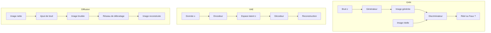

##Introduction
Les modèles génératifs sont une famille de modèles de deep learning qui visent à apprendre la distribution sous-jacente des données pour en générer de nouvelles. Contrairement aux modèles discriminatifs qui apprennent la frontière de décision, les modèles génératifs cherchent à comprendre la structure et les caractéristiques des données elles-mêmes. Cette capacité à générer de nouvelles données similaires à celles utilisées pour l'entraînement a des applications concrètes dans des domaines tels que la génération d'images, la création de musique, la conception de molécules et même la super-résolution d'images.

##Concepts clés
Pour comprendre les modèles génératifs, plusieurs notions clés sont essentielles :
- **Generative Adversarial Networks (GANs)** : Il s'agit de deux réseaux (un générateur et un discriminateur) qui s'entraînent en compétition. Le générateur cherche à créer de nouvelles données réalistes, tandis que le discriminateur essaie de distinguer entre les données réelles et celles générées. Cette compétition se traduit mathématiquement par l'optimisation d'un objectif tel que :
  $$\min_G \max_D \; \mathbb{E}_{x \sim p_\text{data}}[\log D(x)] + \mathbb{E}_{z \sim p_z}[\log(1 - D(G(z)))]$$
- **Variational Autoencoders (VAEs)** : Les VAEs utilisent un encodeur pour compresser les données en un espace latent et un décodeur pour reconstruire les données à partir de cet espace. L'objectif est d'optimiser une borne inférieure de la vraisemblance (ELBO) :
  $$\mathcal{L} = \mathbb{E}_{q(z|x)}[\log p(x|z)] - D_\text{KL}(q(z|x) \| p(z))$$
- **Modèles de diffusion** : Ces modèles apprennent à inverser un processus de bruitage progressif. Le processus forward ajoute du bruit aux données, et le réseau cherche à prédire le bruit ajouté pour reconstruire les données originales pas à pas, sur la base d'une loi de probabilité telle que :
  $$q(x_t | x_{t-1}) = \mathcal{N}(x_t; \sqrt{1-\beta_t}\, x_{t-1}, \beta_t I)$$

##Diagrammes

Le diagramme suivant compare les trois grandes familles de modèles génératifs :

##État de l'art
Récemment, les avancées dans le domaine des modèles génératifs ont été spectaculaires, avec des applications dans la génération d'images réalistes (comme le montrent les articles "**Pre to Post-Treatment Glioblastoma MRI Prediction using a Latent Diffusion Model**" et "**A 3D generative model of pathological multi-modal MR images and segmentations**"), la création de musique, et même la conception de molécules. Les travaux tels que "**DiM: Distilling Dataset into Generative Model**" et "**Generative Models in Decision Making: A Survey**" mettent en lumière les possibilités d'utilisation de ces modèles pour améliorer la prise de décision et la génération de données synthétiques pour l'augmentation de données. De plus, des études comme "**Operationalizing Specifications, In Addition to Test Sets for Evaluating Constrained Generative Models**" soulignent l'importance d'évaluer ces modèles de manière plus approfondie.

##Pour aller plus loin
Pour une exploration plus approfondie du domaine des modèles génératifs, il est recommandé de consulter les articles mentionnés et de suivre les développements récents dans les conférences et les journaux scientifiques dédiés à l'intelligence artificielle et au deep learning. Les sujets tels que l'amélioration de la stabilité et de la diversité des générateurs, l'intégration de contraintes dans les modèles génératifs, et l'application de ces modèles à des problèmes du monde réel sont des pistes prometteuses pour la recherche future. De plus, les cours en ligne et les livres sur le deep learning et les probabilités offrent une base solide pour comprendre les concepts fondamentaux nécessaires à la maîtrise des modèles génératifs.