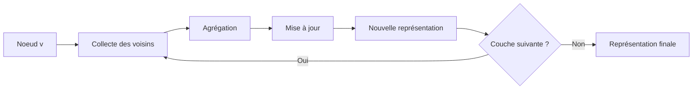

## Introduction
Les Graph Neural Networks (GNNs) sont une famille de réseaux de neurones conçus pour opérer directement sur des données structurées en graphes. Contrairement aux images (grilles) ou au texte (séquences), les graphes ont une topologie irrégulière, ce qui signifie que les éléments sont connectés de manière arbitraire. Les GNNs sont importants car ils permettent d'exploiter la structure relationnelle des données pour résoudre des problèmes complexes tels que la prédiction de propriétés moléculaires, la recommandation de produits ou la classification de nœuds dans les réseaux sociaux.

Les GNNs sont particulièrement utiles pour traiter des données qui présentent des relations complexes entre les éléments, telles que les interactions entre les protéines, les réseaux sociaux ou les systèmes de recommandation. En apprenant des représentations de nœuds, d'arêtes ou du graphe entier, les GNNs peuvent capturer ces relations et les utiliser pour prendre des décisions éclairées.

## Concepts clés
Les concepts clés des GNNs incluent :

* **Message passing** : chaque nœud met à jour sa représentation en agrégeant les messages de ses voisins :
$$h_v^{(l+1)} = \text{UPDATE}\left(h_v^{(l)}, \text{AGGREGATE}\left(\{h_u^{(l)} : u \in \mathcal{N}(v)\}\right)\right)$$

* **Graph Convolutional Networks (GCN)** : les GCN généralisent la convolution aux graphes via une propagation spectrale simplifiée :
$$H^{(l+1)} = \sigma\left(\tilde{D}^{-\frac{1}{2}} \tilde{A} \tilde{D}^{-\frac{1}{2}} H^{(l)} W^{(l)}\right)$$
où $\tilde{A} = A + I$ est la matrice d'adjacence augmentée et $\tilde{D}$ la matrice de degré correspondante.

* **Graph Attention Networks (GAT)** : les GAT utilisent un mécanisme d'attention pour pondérer différemment les contributions de chaque voisin, permettant au modèle d'apprendre quelles connexions sont les plus importantes.

## Diagrammes

Le diagramme suivant illustre le mécanisme de message passing, brique fondamentale des GNNs :

## État de l'art
Les recherches récentes sur les GNNs explorent plusieurs directions prometteuses.

**Graphes hétérogènes** — L'article "MECCH: Metapath Context Convolution-based Heterogeneous Graph Neural Networks" propose une architecture pour les graphes contenant plusieurs types de nœuds et d'arêtes, en utilisant des contextes de méta-chemins pour agréger l'information sans perte ni redondance.

**Lien avec les Transformers** — "Transformers are Graph Neural Networks" établit un pont théorique entre les deux architectures : les Transformers peuvent être vus comme des GNNs opérant sur des graphes fully connectés, où l'auto-attention joue le rôle du message passing. Cette perspective explique pourquoi les Transformers dominent sur le matériel moderne, grâce à leurs opérations matricielles denses.

**Passage à l'échelle** — "Fast and Deep Graph Neural Networks" aborde le problème de l'efficacité en proposant des GNNs profondes avec des poids récurrents non entraînés, atteignant des performances compétitives avec une complexité réduite.

**Limites des GNNs** — "Modern graph neural networks do worse than classical greedy algorithms in solving combinatorial optimization problems" montre qu'un simple algorithme glouton peut surpasser les GNNs sur des problèmes comme le maximum independent set, rappelant l'importance de comparer avec des baselines classiques.

**Applications pratiques** — "Missing Data Imputation with Adversarially-trained Graph Convolutional Networks" applique les GCN à l'imputation de données manquantes, en modélisant la similarité entre instances comme un graphe et en utilisant un entraînement adversaire pour améliorer la qualité des prédictions.

## Pour aller plus loin
Pour approfondir vos connaissances sur les GNNs, nous recommandons :

* Le cours Stanford CS224W "Machine Learning with Graphs"
* Le tutoriel PyTorch Geometric pour des implémentations pratiques
* Le survey "A Comprehensive Survey on Graph Neural Networks" (Wu et al., 2020)
* Les prérequis : [Deep Learning](../deep-learning/), théorie des graphes, algèbre linéaire
