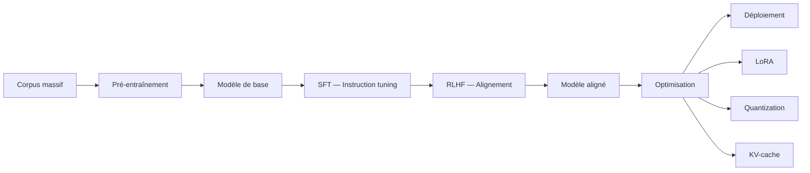

##Introduction
Les Large Language Models (LLMs) sont des modèles de deep learning qui ont révolutionné le traitement du langage naturel. Entraînés sur d'immenses corpus textuels, ces modèles sont capables de comprendre et de générer du langage de manière très performante. Ils sont basés sur l'architecture Transformer et ont été adoptés dans de nombreux domaines tels que les assistants conversationnels, la génération de code, la recherche scientifique automatique, l'éducation, la santé, le droit et l'ingénierie. Comprendre leur fonctionnement est essentiel pour tout praticien de l'IA, car ils sont au cœur de la révolution actuelle de l'intelligence artificielle.

##Concepts clés
Les notions fondamentales pour comprendre les LLMs incluent l'architecture Transformer, les lois d'échelle, l'alignement et les techniques d'efficacité. L'architecture Transformer repose sur le mécanisme d'auto-attention, qui peut être représenté par la formule :
$$\text{Attention}(Q, K, V) = \text{softmax}\left(\frac{QK^T}{\sqrt{d_k}}\right)V$$
Les LLMs utilisent typiquement un Transformer décodeur uniquement, où chaque token ne peut attendre que les tokens précédents. Les lois d'échelle montrent que la performance des LLMs suit des lois de puissance prévisibles en fonction du nombre de paramètres $N$, de la taille du dataset $D$ et du budget de calcul $C$ :
$$L(N) \propto N^{-\alpha}$$
L'alignement est réalisé via des méthodes telles que le Reinforcement Learning from Human Feedback (RLHF), qui permet d'optimiser le modèle pour suivre les intentions humaines. Des techniques d'efficacité comme LoRA, la quantization et le KV-cache sont utilisées pour améliorer la rapidité et la précision des LLMs.

##Diagrammes

Le diagramme suivant résume le pipeline complet d'entraînement et de déploiement d'un LLM :

##État de l'art
Les recherches récentes ont exploré divers aspects des LLMs. Par exemple, l'article "Enhancing Human-Like Responses in Large Language Models" présente des techniques pour améliorer les réponses des LLMs pour les rendre plus semblables à celles des humains. L'article "Is Self-knowledge and Action Consistent or Not: Investigating Large Language Model's Personality" examine la personnalité des LLMs et son alignement avec leurs actions. D'autres articles comme "Large Language Models Lack Understanding of Character Composition of Words" et "Unmasking the Shadows of AI: Investigating Deceptive Capabilities in Large Language Models" soulignent les limites et les risques potentiels des LLMs. Les avancées dans les domaines tels que la multimodalité, avec des études comme "TEAL: Tokenize and Embed ALL for Multi-modal Large Language Models", et l'application des LLMs dans des secteurs spécifiques, comme montré dans "Large Language Models in Ambulatory Devices for Home Health Diagnostics: A case study of Sickle Cell Anemia Management", démontrent la versatilité et le potentiel des LLMs.

##Pour aller plus loin
Pour approfondir votre compréhension des LLMs, il est recommandé de consulter les articles de recherche récents tels que "Reinforcement Learning Meets Large Language Models: A Survey of Advancements and Applications Across the LLM Lifecycle" et "Emissions and Performance Trade-off Between Small and Large Language Models". Explorer les applications pratiques des LLMs dans différents domaines, comme l'éducation ou la santé, peut également fournir des insights précieux. Enfin, les cours en ligne et les tutorials sur le deep learning et le traitement du langage naturel peuvent servir de ressources précieuses pour ceux qui souhaitent mettre en pratique leurs connaissances sur les LLMs.