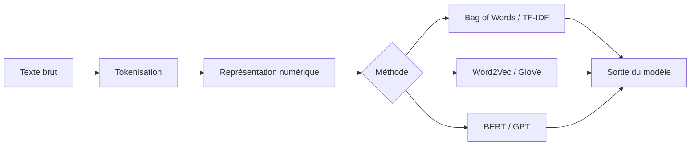

##Introduction
Le traitement automatique du langage naturel, ou Natural Language Processing (NLP), est un domaine de l'intelligence artificielle qui permet aux machines de comprendre, interpréter et générer du langage humain. C'est un champ passionnant qui a donné naissance à des technologies telles que les chatbots, la traduction automatique, les moteurs de recherche modernes et les modèles de langage basés sur les Transformers. Le NLP est important car il nous permet d'automatiser l'analyse de grands volumes de textes, ce qui est particulièrement utile pour la modération de contenu, l'analyse de sentiment, l'extraction d'informations, le résumé automatique et les assistants conversationnels comme ChatGPT.

##Concepts clés
Pour comprendre le NLP, il est essentiel de maîtriser quelques notions fondamentales. Tout d'abord, il faut **représenter le texte sous forme numérique** pour que les machines puissent le traiter. Cela se fait par le biais de la **tokenisation**, qui découpe le texte en unités telles que les mots ou les caractères, et de méthodes comme le **Bag of Words** ou **TF-IDF**, qui analysent la fréquence des mots dans un document. Les **Word Embeddings** comme Word2Vec et GloVe sont des représentations plus avancées qui capturent le sens des mots en les associant à des vecteurs dans un espace à haute dimension. Les **embeddings contextuels** tels que BERT et GPT permettent de représenter les mots en fonction de leur contexte dans la phrase.

Un autre concept clé est le **mécanisme d'attention**, qui permet à un modèle de se concentrer sur différentes parties de la séquence d'entrée avec des poids différents. Cela est réalisé par la formule d'attention :
$$\text{Attention}(Q, K, V) = \text{softmax}\left(\frac{QK^T}{\sqrt{d_k}}\right)V$$
Cette formule calcule les poids d'attention en fonction des requêtes ($Q$), des clés ($K$) et des valeurs ($V$), et est au cœur des architectures Transformer.

##Diagrammes

Le diagramme suivant illustre le pipeline de traitement du texte en NLP, des données brutes jusqu'à la sortie du modèle :

##État de l'art
Les avancées récentes dans le domaine du NLP sont considérables. Les **Transformers** ont révolutionné le traitement du langage en permettant un traitement parallèle de toute la séquence d'entrée. Les modèles comme **BERT**, présentés dans l'article "BERT: Pre-training of Deep Bidirectional Transformers for Language Understanding", ont prouvé leur efficacité dans les tâches de compréhension du langage. L'article "Language Models are Few-Shot Learners" montre comment les modèles de langage à grande échelle comme GPT-3 peuvent apprendre à effectuer diverses tâches avec peu d'exemples. Les **Word Embeddings**, introduits dans "Efficient Estimation of Word Representations in Vector Space", ont amélioré la représentation des mots dans un espace vectoriel. La **génération de texte** basée sur le mécanisme d'attention et les Transformers a également fait l'objet de recherches approfondies, comme le montre "Retrieval-Augmented Generation for Knowledge-Intensive NLP Tasks". Du côté des modèles open-source, "LLaMA: Open and Efficient Foundation Language Models" démontre qu'un modèle plus petit mais entraîné sur davantage de données peut rivaliser avec les plus grands modèles propriétaires, rendant la recherche en NLP plus accessible.

##Pour aller plus loin
Pour approfondir vos connaissances en NLP, il est recommandé de lire les articles de base tels que "Sequence to Sequence Learning with Neural Networks" et "Neural Machine Translation by Jointly Learning to Align and Translate". Les réseaux de neurones récurrents (RNN) et les modèles de langage basés sur les Transformers sont des sujets de recherche actifs. Les frameworks comme Hugging Face Transformers offrent des implantations pratiques de ces modèles. Enfin, explorer les applications pratiques du NLP, telles que la modération de contenu, l'analyse de sentiment et la traduction automatique, peut aider à comprendre l'impact concret de ces technologies sur la société.